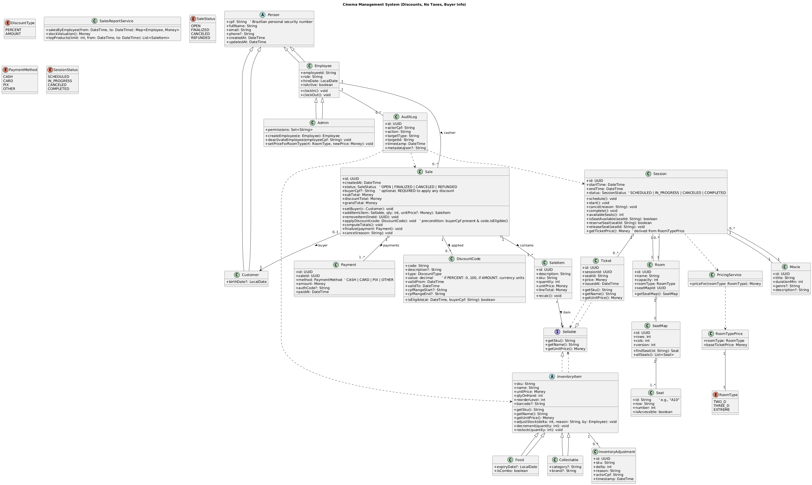

# Classes Diagram Overview

This document describes the **main classes, enums, and relationships** of the Cinema Management System. It summarizes the UML class diagram into a **readable reference**.

---

## 1. People & Roles

### **Person (abstract)**

- **ID**: `cpf` (Brazilian personal security number)
- **Fields**: `fullName`, `email`, `phone?`, `createdAt`, `updatedAt`
- **Purpose**: Base class for all people in the system.

### **Customer (extends Person)**

- **Fields**: `birthDate?`
- **Notes**: Used when a sale must record buyer info (especially for discounts).

### **Employee (extends Person)**

- **Fields**: `employeeId`, `role`, `hireDate`, `isActive`
- **Methods**: `clockIn()`, `clockOut()`
- **Purpose**: Tracks staff that can make sales or stock adjustments.

### **Admin (extends Employee)**

- **Fields**: `permissions`
- **Methods**:
  - `createEmployee(e: Employee)`
  - `deactivateEmployee(cpf)`
  - `setPriceForRoomType(rt, newPrice)`
- **Purpose**: Higher-level control of employees and pricing.

---

## 2. Movies, Rooms, and Sessions

### **Movie**

- **Fields**: `id`, `title`, `durationMin`, `genre?`, `description?`
- **Notes**: A movie can have multiple scheduled sessions.

### **Room**

- **Fields**: `id`, `name`, `capacity`, `roomType`, `seatMapId`
- **Methods**: `getSeatMap()`
- **Notes**: Each room has a **seat map** and a **room type** (2D, 3D, Extreme).

### **SeatMap**

- **Fields**: `id`, `rows`, `cols`, `version`
- **Methods**: `findSeat(id)`, `allSeats()`
- **Relations**: Owns many `Seat`.

### **Seat**

- **Fields**: `id` (e.g. "A10"), `row`, `number`, `isAccessible`.

### **Session**

- **Fields**: `id`, `startTime`, `endTime`, `status`
- **Methods**: `schedule()`, `start()`, `cancel()`, `complete()`,  
  `availableSeats()`, `reserveSeat(seatId)`, `releaseSeat(seatId)`, `getTicketPrice()`
- **Relations**: Belongs to one `Movie` and one `Room`, issues many `Tickets`.

### **Ticket (implements Sellable)**

- **Fields**: `id`, `sessionId`, `seatId`, `price`, `issuedAt`
- **Methods**: `getSku()`, `getName()`, `getUnitPrice()`
- **Notes**: Represents a purchased seat for a session.

---

## 3. Inventory & Stock

### **InventoryItem (abstract, implements Sellable)**

- **Fields**: `sku`, `name`, `unitPrice`, `qtyOnHand`, `reorderLevel`, `barcode?`
- **Methods**: `adjustStock()`, `decrement()`, `restock()`
- **Notes**: Base for physical goods sold.

### **Food (extends InventoryItem)**

- **Fields**: `expiryDate?`, `isCombo`.

### **Collectable (extends InventoryItem)**

- **Fields**: `category?`, `brand?`.

### **InventoryAdjustment**

- **Fields**: `id`, `sku`, `delta`, `reason`, `actorCpf`, `timestamp`
- **Purpose**: Log of every stock change.

---

## 4. Sales / POS

### **Sale**

- **Fields**:
  - `id`, `createdAt`, `status`
  - `buyerCpf?` (optional; required to apply discounts)
  - `subTotal`, `discountTotal`, `grandTotal`
- **Methods**:
  - `setBuyer(c: Customer)`
  - `addItem(item, qty, unitPrice?)`
  - `removeItem(lineId)`
  - `applyDiscount(code)` (_requires buyerCpf & eligibility check_)
  - `computeTotals()`, `finalize(payment)`, `cancel(reason)`
- **Relations**: Has many `SaleItem`, `Payment`, and applied `DiscountCode`.

### **SaleItem**

- **Fields**: `id`, `description`, `sku`, `quantity`, `unitPrice`, `lineTotal`
- **Methods**: `recalc()`
- **Purpose**: One line of a sale.

### **Payment**

- **Fields**: `id`, `saleId`, `method`, `amount`, `authCode?`, `paidAt`.
- **Notes**: No refund capability.

---

## 5. Discounts

### **DiscountCode**

- **Fields**:
  - `code`, `description?`, `type` (PERCENT/AMOUNT), `value`
  - `validFrom`, `validTo`
  - `cpfRangeStart?`, `cpfRangeEnd?`
- **Methods**: `isEligible(at, buyerCpf)`
- **Relations**: Applied to `Sale`.
- **Rules**: Cannot be used unless `buyerCpf` is set.

---

## 6. Auditing & Reporting

### **AuditLog**

- **Fields**: `id`, `actorCpf`, `action`, `targetType`, `targetId`, `timestamp`, `metadataJson?`
- **Relations**: Linked to actions on `Sale`, `InventoryItem`, `Session`.
- **Purpose**: Traceability of employee actions.

### **PricingService**

- **Method**: `priceFor(roomType)`
- **Purpose**: Get base ticket prices from `RoomTypePrice`.

### **SalesReportService**

- **Methods**:
  - `salesByEmployee(from, to)`
  - `stockValuation()`
  - `topProducts(limit, from, to)`

---

## 7. Enums

- **SaleStatus**: `OPEN`, `FINALIZED`, `CANCELED`, `REFUNDED`
- **PaymentMethod**: `CASH`, `CARD`, `PIX`, `OTHER`
- **SessionStatus**: `SCHEDULED`, `IN_PROGRESS`, `CANCELED`, `COMPLETED`
- **RoomType**: `TWO_D`, `THREE_D`, `EXTREME`
- **DiscountType**: `PERCENT`, `AMOUNT`

---

## 8. Relationships (Highlights)

- **Person hierarchy**: `Customer`, `Employee`, `Admin` all extend `Person`.
- **Movie → Session → Ticket**: A movie has sessions, sessions issue tickets.
- **Room → Session**: Sessions occur in rooms, room type defines pricing.
- **SeatMap → Seat**: Rooms are linked to seat maps.
- **Sale → SaleItem, Payment, DiscountCode**: Each sale aggregates items, payments, and optional discounts.
- **InventoryItem → Food/Collectable**: Specialized stock items.
- **InventoryAdjustment**: Tied to `InventoryItem` changes.
- **AuditLog**: Records who did what (linked by CPF).
