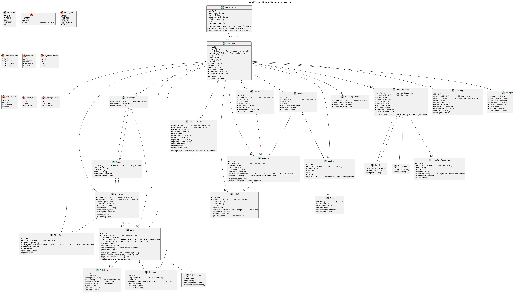

# Multi-Tenant Classes Diagram Overview

This document describes the **main classes, enums, and relationships** of the Multi-Tenant Cinema Management System. It summarizes the UML class diagram into a **readable reference**.

---

## 1. Multi-Tenant Core Classes

### **Company**

- **ID**: `id` (UUID)
- **Fields**: `name`, `cnpj`, `tradeName?`, `address?`, `city?`, `state?`, `zipCode?`, `phone?`, `email?`, `website?`, `isActive`, `createdAt`, `updatedAt`
- **Methods**: `activate()`, `deactivate()`
- **Purpose**: Central tenant entity that owns all business data. Each company operates as an isolated tenant.

### **SystemAdmin**

- **ID**: `id` (UUID)
- **Fields**: `username`, `email`, `passwordHash`, `isActive`, `lastLogin?`, `createdAt`
- **Methods**: `createCompany()`, `activateCompany()`, `deactivateCompany()`
- **Purpose**: Cross-tenant administrators who can manage multiple companies and platform-wide operations.

### **CompanySubscription**

- **ID**: `companyId` (UUID)
- **Fields**: `plan`, `startDate`, `endDate?`, `maxEmployees`, `maxRooms`, `isActive`, `monthlyFee`
- **Purpose**: Defines subscription limits and billing for each company tenant.

---

## 2. People & Roles

### **Person (abstract)**

- **ID**: `cpf` (Brazilian personal security number)
- **Fields**: `fullName`, `email`, `phone?`, `createdAt`, `updatedAt`
- **Purpose**: Base class for all people in the system.

### **Customer (extends Person)**

- **ID**: `[cpf, companyId]` (Compound primary key)
- **Fields**: `companyId` (UUID), `birthDate?`, `loyaltyPoints`
- **Notes**: Scoped to company. Used when a sale must record buyer info (especially for discounts).

### **Employee (extends Person)**

- **ID**: `[cpf, companyId]` (Compound primary key)
- **Fields**: `companyId` (UUID), `employeeId`, `role`, `hireDate`, `isActive`, `passwordHash`, `permissions`, `lastLogin?`
- **Methods**: `clockIn()`, `clockOut()`
- **Purpose**: Company-scoped staff that can make sales or stock adjustments. Authentication includes company context.

### **TimeEntry**

- **ID**: `id` (UUID)
- **Fields**: `companyId` (UUID), `employeeCpf`, `entryType`, `timestamp`, `notes?`, `ipAddress?`, `location?`
- **EntryType**: `CLOCK_IN`, `CLOCK_OUT`, `BREAK_START`, `BREAK_END`
- **Purpose**: Tracks employee work hours and break times within each company.

---

## 3. Movies, Rooms, and Sessions

### **Movie**

- **ID**: `id` (UUID)
- **Fields**: `companyId` (UUID), `title`, `durationMin`, `genre?`, `description?`, `rating?`, `releaseDate?`, `isActive`
- **Notes**: Company-scoped movies. Each company manages its own movie catalog.

### **Room**

- **ID**: `id` (UUID)
- **Fields**: `companyId` (UUID), `name`, `capacity`, `roomType`, `seatMapId`, `isActive`
- **Methods**: `getSeatMap()`
- **Notes**: Company-scoped rooms with seat maps and room types (2D, 3D, IMAX, EXTREME, VIP).

### **RoomTypePrice**

- **ID**: `[companyId, roomType]` (Compound primary key)
- **Fields**: `companyId` (UUID), `roomType`, `baseTicketPrice`, `updatedAt`
- **Purpose**: Company-specific pricing for different room types. Allows each tenant to set their own ticket prices.

### **SeatMap**

- **ID**: `id` (UUID)
- **Fields**: `companyId` (UUID), `name`, `rows`, `cols`, `version`, `layout` (JSON)
- **Methods**: `findSeat(id)`, `allSeats()`
- **Relations**: Owns many `Seat`
- **Purpose**: Company-scoped seat layout configuration with flexible JSON-based seat arrangements.

### **Seat**

- **ID**: `id` (e.g. "A10")
- **Fields**: `seatMapId`, `rowLabel`, `number`, `isAccessible`, `isActive`
- **Purpose**: Individual seats within a seat map. Not directly tenant-scoped (scoped through SeatMap).

### **Session**

- **ID**: `id` (UUID)
- **Fields**: `companyId` (UUID), `movieId`, `roomId`, `startTime`, `endTime`, `status`, `basePrice`
- **Methods**: `schedule()`, `start()`, `cancel()`, `complete()`, `availableSeats()`, `reserveSeat(seatId)`
- **Relations**: Belongs to one `Movie` and one `Room`, issues many `Tickets`
- **Purpose**: Company-scoped movie showings with pricing and seat management.

### **Ticket**

- **ID**: `id` (UUID)
- **Fields**: `companyId` (UUID), `sessionId`, `seatId`, `saleId`, `price`, `status`, `issuedAt`, `usedAt?`, `qrCode`
- **Status**: `ISSUED`, `USED`, `REFUNDED`
- **Purpose**: Company-scoped ticket for specific seat and session with QR code for validation.

---

## 4. Inventory & Stock

### **InventoryItem (abstract)**

- **ID**: `[sku, companyId]` (Compound primary key)
- **Fields**: `companyId` (UUID), `sku`, `name`, `unitPrice`, `qtyOnHand`, `reorderLevel`, `barcode?`, `isActive`, `createdAt`, `updatedAt`
- **Methods**: `adjustStock(delta, reason, by)`, `decrement()`, `restock()`
- **Purpose**: Company-scoped base class for sellable physical goods.

### **Food (extends InventoryItem)**

- **Fields**: `expiryDate?`, `isCombo`, `category?`
- **Purpose**: Food and beverage items with expiration tracking.

### **Collectable (extends InventoryItem)**

- **Fields**: `category?`, `brand?`
- **Purpose**: Merchandise and collectible items.

### **InventoryAdjustment**

- **ID**: `id` (UUID)
- **Fields**: `companyId` (UUID), `sku`, `delta`, `reason`, `actorCpf`, `timestamp`, `notes?`
- **Purpose**: Company-scoped log of every stock change for audit trail.

---

## 5. Sales / POS

### **Sale**

- **ID**: `id` (UUID)
- **Fields**: `companyId` (UUID), `createdAt`, `status`, `cashierCpf`, `buyerCpf?`, `subTotal`, `discountTotal`, `taxTotal`, `grandTotal`
- **Status**: `OPEN`, `FINALIZED`, `CANCELED`, `REFUNDED`
- **Methods**: `setBuyer()`, `addItem()`, `applyDiscount()`, `computeTotals()`, `finalize()`, `cancel()`
- **Relations**: Has many `SaleItem`, `Payment`, and applied `DiscountCode`
- **Purpose**: Company-scoped point-of-sale transactions with employee tracking.

### **SaleItem**

- **ID**: `id` (UUID)
- **Fields**: `companyId` (UUID), `saleId`, `description`, `sku?`, `sessionId?`, `seatId?`, `quantity`, `unitPrice`, `lineTotal`
- **Methods**: `recalc()`
- **Purpose**: Individual line items in a sale, supporting both inventory items and tickets.

### **Payment**

- **ID**: `id` (UUID)
- **Fields**: `companyId` (UUID), `saleId`, `method`, `amount`, `authCode?`, `paidAt`
- **Method**: `CASH`, `CARD`, `PIX`, `OTHER`
- **Purpose**: Company-scoped payment records for sales.

### **SaleDiscount**

- **ID**: `[saleId, code]` (Compound primary key)
- **Fields**: `saleId`, `code`, `appliedAt`, `discountAmount`
- **Purpose**: Junction table linking sales to applied discount codes with applied amounts.

---

## 6. Discounts

### **DiscountCode**

- **ID**: `[code, companyId]` (Compound primary key)
- **Fields**: `companyId` (UUID), `code`, `description?`, `type`, `value`, `validFrom`, `validTo`, `cpfRangeStart?`, `cpfRangeEnd?`, `maxUses?`, `currentUses`, `isActive`
- **Type**: `PERCENT`, `AMOUNT`, `BOGO` (Buy One Get One)
- **Methods**: `isEligible(at, buyerCpf)`
- **Relations**: Applied to `Sale` through `SaleDiscount`
- **Purpose**: Company-scoped discount codes with usage tracking and eligibility rules.

---

## 7. Auditing & Reporting

### **AuditLog**

- **ID**: `id` (UUID)
- **Fields**: `companyId` (UUID), `actorCpf`, `action`, `targetType`, `targetId?`, `timestamp`, `metadataJson?`, `ipAddress?`, `userAgent?`
- **Relations**: Linked to actions on `Sale`, `InventoryItem`, `Session`, etc.
- **Purpose**: Company-scoped audit trail for employee actions and system events.

### **PricingService**

- **Method**: `priceFor(roomType)`
- **Purpose**: Get base ticket prices from `RoomTypePrice`.

### **SalesReportService**

- **Methods**:
  - `salesByEmployee(from, to)`
  - `stockValuation()`
  - `topProducts(limit, from, to)`

---

## 8. Enums

- **EmployeeRole**: `ADMIN`, `MANAGER`, `CASHIER`, `MAINTENANCE`, `SECURITY`
- **TimeEntryType**: `CLOCK_IN`, `CLOCK_OUT`, `BREAK_START`, `BREAK_END`
- **SaleStatus**: `OPEN`, `FINALIZED`, `CANCELED`, `REFUNDED`
- **PaymentMethod**: `CASH`, `CARD`, `PIX`, `OTHER`
- **SessionStatus**: `SCHEDULED`, `IN_PROGRESS`, `CANCELED`, `COMPLETED`
- **RoomType**: `TWO_D`, `THREE_D`, `IMAX`, `EXTREME`, `VIP`
- **DiscountType**: `PERCENT`, `AMOUNT`, `BOGO`
- **TicketStatus**: `ISSUED`, `USED`, `REFUNDED`
- **SubscriptionPlan**: `BASIC`, `PREMIUM`, `ENTERPRISE`

---

## 9. Relationships (Highlights)

### **Multi-Tenant Core**
- **Company → All Business Entities**: Every business entity includes `companyId` for complete data isolation
- **SystemAdmin → Company**: Cross-tenant administrators can manage multiple companies
- **Company → CompanySubscription**: One-to-one relationship defining tenant limits and billing

### **Business Entity Relationships**
- **Person hierarchy**: `Customer`, `Employee` both extend `Person` with company scoping
- **Employee → TimeEntry**: Employees track work hours within their company
- **Movie → Session → Ticket**: Company-scoped movie scheduling and ticketing workflow
- **Room → Session**: Company rooms host sessions, room type defines tenant-specific pricing
- **SeatMap → Seat**: Company-scoped seat layout management
- **Sale → SaleItem, Payment, SaleDiscount**: Company-scoped POS with multi-tenant discounts
- **InventoryItem → Food/Collectable**: Company-specific inventory with stock tracking
- **InventoryAdjustment**: Company-scoped audit trail for stock changes
- **AuditLog**: Complete activity tracking within company boundaries

### **Data Isolation**
- All compound primary keys include `companyId` where applicable (Customer, Employee)
- Foreign key relationships respect tenant boundaries
- Cross-tenant access only available to SystemAdmin role
