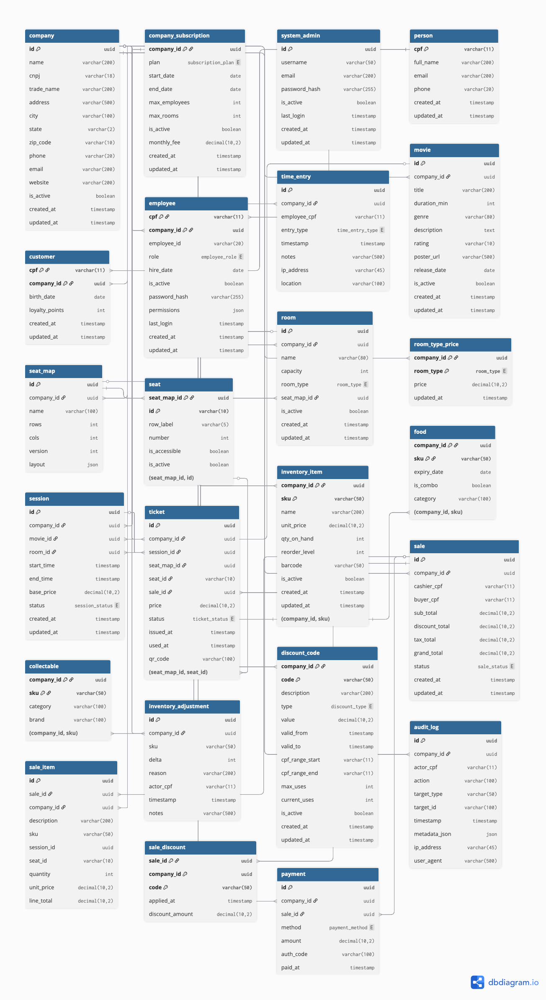

# 🗄️ Multi-Tenant Database Schema Documentation

This document provides comprehensive documentation of the Multi-Tenant Backstage Cinema database schema, including tables, relationships, and data isolation patterns.

## 📊 Physical Database Diagram



The diagram above shows the complete physical database structure with all tables, relationships, and multi-tenant architecture patterns.

### Diagram Source Code

The diagram is generated from code using [dbdiagram.io](https://dbdiagram.io/). The source DBML file is available at [`database-schema.dbml`](../../database-schema.dbml) and can be imported into dbdiagram.io for editing and regeneration.

## 📋 Overview

The multi-tenant cinema management system uses **PostgreSQL 15** as its primary database, following a **company-scoped relational design** that supports:

- **🏢 Multi-tenant architecture**: Complete data isolation between cinema companies
- **🎬 Movie catalog and session management** per company
- **👥 Customer and employee management** with company boundaries
- **🎫 Ticket sales and seat reservations** scoped to company operations
- **🏪 Point of sale and inventory tracking** per tenant
- **🎟️ Discount codes and promotions** within company scope
- **📊 Comprehensive audit logging** with tenant isolation
- **👑 System administration** with cross-tenant capabilities

## 🏢 Multi-Tenant Core Tables

### Company Management

```sql
-- Central tenant entity
CREATE TABLE company (
  id UUID PRIMARY KEY DEFAULT gen_random_uuid(),
  name VARCHAR(200) NOT NULL,
  cnpj VARCHAR(18) UNIQUE NOT NULL, -- Brazilian company identifier
  "tradeName" VARCHAR(200),
  address TEXT,
  city VARCHAR(100),
  state VARCHAR(50),
  "zipCode" VARCHAR(10),
  phone VARCHAR(20),
  email VARCHAR(200),
  website VARCHAR(500),
  "isActive" BOOLEAN DEFAULT true,
  "createdAt" TIMESTAMP DEFAULT CURRENT_TIMESTAMP,
  "updatedAt" TIMESTAMP DEFAULT CURRENT_TIMESTAMP
);

-- System administrators (cross-tenant)
CREATE TABLE system_admin (
  id UUID PRIMARY KEY DEFAULT gen_random_uuid(),
  username VARCHAR(100) UNIQUE NOT NULL,
  email VARCHAR(200) UNIQUE NOT NULL,
  "passwordHash" VARCHAR(255) NOT NULL,
  "isActive" BOOLEAN DEFAULT true,
  "lastLogin" TIMESTAMP,
  "createdAt" TIMESTAMP DEFAULT CURRENT_TIMESTAMP
);

-- Company subscription plans and limits
CREATE TABLE company_subscription (
  "companyId" UUID PRIMARY KEY REFERENCES company(id) ON DELETE CASCADE,
  plan subscription_plan NOT NULL, -- BASIC, PREMIUM, ENTERPRISE
  "startDate" TIMESTAMP NOT NULL,
  "endDate" TIMESTAMP,
  "maxEmployees" INTEGER NOT NULL DEFAULT 10,
  "maxRooms" INTEGER NOT NULL DEFAULT 5,
  "isActive" BOOLEAN DEFAULT true,
  "monthlyFee" DECIMAL(10,2) NOT NULL,
  "createdAt" TIMESTAMP DEFAULT CURRENT_TIMESTAMP,
  "updatedAt" TIMESTAMP DEFAULT CURRENT_TIMESTAMP
);
```

## 🎬 Movies and Sessions (Company-Scoped)

```sql
-- Company-scoped movies catalog
CREATE TABLE movie (
  id UUID PRIMARY KEY DEFAULT gen_random_uuid(),
  "companyId" UUID NOT NULL REFERENCES company(id) ON DELETE CASCADE,
  title VARCHAR(200) NOT NULL,
  "durationMin" INTEGER NOT NULL,
  genre VARCHAR(80),
  description TEXT,
  rating VARCHAR(10), -- G, PG, PG-13, R, NC-17, NR
  "releaseDate" DATE,
  "isActive" BOOLEAN DEFAULT true,
  "createdAt" TIMESTAMP DEFAULT CURRENT_TIMESTAMP,
  "updatedAt" TIMESTAMP DEFAULT CURRENT_TIMESTAMP
);

-- Company-scoped theater rooms
CREATE TABLE room (
  id UUID PRIMARY KEY DEFAULT gen_random_uuid(),
  "companyId" UUID NOT NULL REFERENCES company(id) ON DELETE CASCADE,
  name VARCHAR(80) NOT NULL,
  capacity INTEGER NOT NULL,
  "roomType" room_type NOT NULL, -- TWO_D, THREE_D, IMAX, EXTREME, VIP
  "seatMapId" UUID REFERENCES seat_map(id),
  "isActive" BOOLEAN DEFAULT true,
  UNIQUE ("companyId", name)
);

-- Company-scoped room pricing
CREATE TABLE room_type_price (
  "companyId" UUID NOT NULL REFERENCES company(id) ON DELETE CASCADE,
  "roomType" room_type NOT NULL,
  "baseTicketPrice" DECIMAL(10,2) NOT NULL,
  "updatedAt" TIMESTAMP DEFAULT CURRENT_TIMESTAMP,
  PRIMARY KEY ("companyId", "roomType")
);

-- Company-scoped movie sessions
CREATE TABLE session (
  id UUID PRIMARY KEY DEFAULT gen_random_uuid(),
  "companyId" UUID NOT NULL REFERENCES company(id) ON DELETE CASCADE,
  "movieId" UUID NOT NULL REFERENCES movie(id) ON DELETE CASCADE,
  "roomId" UUID NOT NULL REFERENCES room(id) ON DELETE RESTRICT,
  "startTime" TIMESTAMP NOT NULL,
  "endTime" TIMESTAMP NOT NULL,
  status session_status DEFAULT 'SCHEDULED',
  "basePrice" DECIMAL(10,2) -- Can override room type price
);
```

### Company-Scoped Seat Management

```sql
-- Company-scoped seat map configuration
CREATE TABLE seat_map (
  id UUID PRIMARY KEY DEFAULT gen_random_uuid(),
  "companyId" UUID NOT NULL REFERENCES company(id) ON DELETE CASCADE,
  name VARCHAR(100) NOT NULL,
  rows INTEGER NOT NULL,
  cols INTEGER NOT NULL,
  version INTEGER DEFAULT 1,
  layout JSONB, -- Flexible seat layout configuration
  UNIQUE ("companyId", name)
);

-- Individual seats (not directly tenant-scoped, scoped through seat_map)
CREATE TABLE seat (
  "seatMapId" UUID REFERENCES seat_map(id) ON DELETE CASCADE,
  id VARCHAR(10), -- e.g., "A10"
  "rowLabel" VARCHAR(10) NOT NULL,
  number INTEGER NOT NULL,
  "isAccessible" BOOLEAN DEFAULT FALSE,
  "isActive" BOOLEAN DEFAULT true,
  PRIMARY KEY ("seatMapId", id),
  UNIQUE ("seatMapId", "rowLabel", number)
);
```

## 👥 Multi-Tenant People Management

### Company-Scoped Person Hierarchy

```sql
-- Company-scoped customers (compound primary key)
CREATE TABLE customer (
  cpf VARCHAR(14) NOT NULL, -- Brazilian ID number
  "companyId" UUID NOT NULL REFERENCES company(id) ON DELETE CASCADE,
  "fullName" VARCHAR(200) NOT NULL,
  email VARCHAR(200) NOT NULL,
  phone VARCHAR(20),
  "birthDate" DATE,
  "loyaltyPoints" INTEGER DEFAULT 0,
  "createdAt" TIMESTAMP DEFAULT CURRENT_TIMESTAMP,
  "updatedAt" TIMESTAMP DEFAULT CURRENT_TIMESTAMP,
  PRIMARY KEY (cpf, "companyId"),
  UNIQUE ("companyId", email)
);

-- Company-scoped employees (compound primary key)
CREATE TABLE employee (
  cpf VARCHAR(14) NOT NULL, -- Brazilian ID number
  "companyId" UUID NOT NULL REFERENCES company(id) ON DELETE CASCADE,
  "employeeId" VARCHAR(50) NOT NULL,
  "fullName" VARCHAR(200) NOT NULL,
  email VARCHAR(200) NOT NULL,
  phone VARCHAR(20),
  role employee_role NOT NULL, -- ADMIN, MANAGER, CASHIER, MAINTENANCE, SECURITY
  "hireDate" DATE NOT NULL,
  "isActive" BOOLEAN DEFAULT TRUE,
  "passwordHash" VARCHAR(255) NOT NULL,
  permissions JSONB DEFAULT '{}',
  "lastLogin" TIMESTAMP,
  "createdAt" TIMESTAMP DEFAULT CURRENT_TIMESTAMP,
  "updatedAt" TIMESTAMP DEFAULT CURRENT_TIMESTAMP,
  PRIMARY KEY (cpf, "companyId"),
  UNIQUE ("companyId", "employeeId"),
  UNIQUE ("companyId", email)
);

-- Company-scoped employee time tracking
CREATE TABLE time_entry (
  id UUID PRIMARY KEY DEFAULT gen_random_uuid(),
  "companyId" UUID NOT NULL REFERENCES company(id) ON DELETE CASCADE,
  "employeeCpf" VARCHAR(14) NOT NULL,
  "entryType" time_entry_type NOT NULL, -- CLOCK_IN, CLOCK_OUT, BREAK_START, BREAK_END
  timestamp TIMESTAMP DEFAULT CURRENT_TIMESTAMP,
  notes TEXT,
  "ipAddress" INET,
  location VARCHAR(200),
  FOREIGN KEY ("employeeCpf", "companyId") REFERENCES employee(cpf, "companyId")
);
```

## 🎫 Multi-Tenant Sales and Transactions

### Company-Scoped Ticket Sales

```sql
-- Company-scoped individual tickets
CREATE TABLE ticket (
  id UUID PRIMARY KEY DEFAULT gen_random_uuid(),
  "companyId" UUID NOT NULL REFERENCES company(id) ON DELETE CASCADE,
  "sessionId" UUID NOT NULL REFERENCES session(id) ON DELETE CASCADE,
  "seatId" VARCHAR(10) NOT NULL,
  "saleId" UUID REFERENCES sale(id) ON DELETE CASCADE,
  price DECIMAL(10,2) NOT NULL,
  status ticket_status DEFAULT 'ISSUED', -- ISSUED, USED, REFUNDED
  "issuedAt" TIMESTAMP DEFAULT CURRENT_TIMESTAMP,
  "usedAt" TIMESTAMP,
  "qrCode" VARCHAR(100) UNIQUE NOT NULL,
  UNIQUE ("sessionId", "seatId")
);
```

### Company-Scoped Point of Sale

```sql
-- Company-scoped sales transactions
CREATE TABLE sale (
  id UUID PRIMARY KEY DEFAULT gen_random_uuid(),
  "companyId" UUID NOT NULL REFERENCES company(id) ON DELETE CASCADE,
  "createdAt" TIMESTAMP DEFAULT CURRENT_TIMESTAMP,
  status sale_status DEFAULT 'OPEN', -- OPEN, FINALIZED, CANCELED, REFUNDED
  "buyerCpf" VARCHAR(14), -- References customer compound key
  "cashierCpf" VARCHAR(14) NOT NULL, -- References employee compound key
  "subTotal" DECIMAL(10,2) DEFAULT 0,
  "discountTotal" DECIMAL(10,2) DEFAULT 0,
  "taxTotal" DECIMAL(10,2) DEFAULT 0, -- Future tax support
  "grandTotal" DECIMAL(10,2) DEFAULT 0,
  FOREIGN KEY ("buyerCpf", "companyId") REFERENCES customer(cpf, "companyId"),
  FOREIGN KEY ("cashierCpf", "companyId") REFERENCES employee(cpf, "companyId")
);

-- Company-scoped sale line items
CREATE TABLE sale_item (
  id UUID PRIMARY KEY DEFAULT gen_random_uuid(),
  "companyId" UUID NOT NULL REFERENCES company(id) ON DELETE CASCADE,
  "saleId" UUID REFERENCES sale(id) ON DELETE CASCADE,
  description VARCHAR(200) NOT NULL,
  sku VARCHAR(40), -- References inventory_item compound key
  "sessionId" UUID, -- For ticket items
  "seatId" VARCHAR(10), -- For ticket items
  quantity INTEGER NOT NULL DEFAULT 1,
  "unitPrice" DECIMAL(10,2) NOT NULL,
  "lineTotal" DECIMAL(10,2) NOT NULL,
  FOREIGN KEY (sku, "companyId") REFERENCES inventory_item(sku, "companyId")
);

-- Company-scoped payment records
CREATE TABLE payment (
  id UUID PRIMARY KEY DEFAULT gen_random_uuid(),
  "companyId" UUID NOT NULL REFERENCES company(id) ON DELETE CASCADE,
  "saleId" UUID REFERENCES sale(id) ON DELETE CASCADE,
  method payment_method NOT NULL, -- CASH, CARD, PIX, OTHER
  amount DECIMAL(10,2) NOT NULL,
  "authCode" VARCHAR(60),
  "paidAt" TIMESTAMP DEFAULT CURRENT_TIMESTAMP
);

-- Sale discount applications
CREATE TABLE sale_discount (
  "saleId" UUID REFERENCES sale(id) ON DELETE CASCADE,
  code VARCHAR(40) NOT NULL,
  "appliedAt" TIMESTAMP DEFAULT CURRENT_TIMESTAMP,
  "discountAmount" DECIMAL(10,2) NOT NULL,
  PRIMARY KEY ("saleId", code)
);
```

## 🏪 Multi-Tenant Inventory Management

### Company-Scoped Inventory Items

```sql
-- Company-scoped base inventory items
CREATE TABLE inventory_item (
  sku VARCHAR(40) NOT NULL,
  "companyId" UUID NOT NULL REFERENCES company(id) ON DELETE CASCADE,
  name VARCHAR(200) NOT NULL,
  "unitPrice" DECIMAL(10,2) NOT NULL,
  "qtyOnHand" INTEGER DEFAULT 0,
  "reorderLevel" INTEGER DEFAULT 0,
  barcode VARCHAR(64),
  "isActive" BOOLEAN DEFAULT true,
  "createdAt" TIMESTAMP DEFAULT CURRENT_TIMESTAMP,
  "updatedAt" TIMESTAMP DEFAULT CURRENT_TIMESTAMP,
  PRIMARY KEY (sku, "companyId")
);

-- Food items
CREATE TABLE food (
  sku VARCHAR(40) NOT NULL,
  "companyId" UUID NOT NULL,
  "expiryDate" DATE,
  "isCombo" BOOLEAN DEFAULT FALSE,
  category VARCHAR(80),
  PRIMARY KEY (sku, "companyId"),
  FOREIGN KEY (sku, "companyId") REFERENCES inventory_item(sku, "companyId") ON DELETE CASCADE
);

-- Collectible items
CREATE TABLE collectable (
  sku VARCHAR(40) NOT NULL,
  "companyId" UUID NOT NULL,
  category VARCHAR(80),
  brand VARCHAR(80),
  PRIMARY KEY (sku, "companyId"),
  FOREIGN KEY (sku, "companyId") REFERENCES inventory_item(sku, "companyId") ON DELETE CASCADE
);

-- Company-scoped inventory adjustments
CREATE TABLE inventory_adjustment (
  id UUID PRIMARY KEY DEFAULT gen_random_uuid(),
  "companyId" UUID NOT NULL REFERENCES company(id) ON DELETE CASCADE,
  sku VARCHAR(40) NOT NULL,
  delta INTEGER NOT NULL,
  reason VARCHAR(120),
  "actorCpf" VARCHAR(14) NOT NULL, -- Employee who made adjustment
  timestamp TIMESTAMP DEFAULT CURRENT_TIMESTAMP,
  notes TEXT,
  FOREIGN KEY (sku, "companyId") REFERENCES inventory_item(sku, "companyId"),
  FOREIGN KEY ("actorCpf", "companyId") REFERENCES employee(cpf, "companyId")
);
```

## 🎟️ Multi-Tenant Discounts and Promotions

```sql
-- Company-scoped discount codes
CREATE TABLE discount_code (
  code VARCHAR(40) NOT NULL,
  "companyId" UUID NOT NULL REFERENCES company(id) ON DELETE CASCADE,
  description VARCHAR(200),
  type discount_type NOT NULL, -- PERCENT, AMOUNT, BOGO
  value DECIMAL(10,2) NOT NULL,
  "validFrom" TIMESTAMP NOT NULL,
  "validTo" TIMESTAMP NOT NULL,
  "cpfRangeStart" VARCHAR(14),
  "cpfRangeEnd" VARCHAR(14),
  "maxUses" INTEGER,
  "currentUses" INTEGER DEFAULT 0,
  "isActive" BOOLEAN DEFAULT true,
  PRIMARY KEY (code, "companyId")
);
```

## 📊 Multi-Tenant System Tables

### Company-Scoped Audit Logging

```sql
-- Company-scoped audit log
CREATE TABLE audit_log (
  id UUID PRIMARY KEY DEFAULT gen_random_uuid(),
  "companyId" UUID NOT NULL REFERENCES company(id) ON DELETE CASCADE,
  "actorCpf" VARCHAR(14) NOT NULL, -- Employee who performed action
  action VARCHAR(80) NOT NULL,
  "targetType" VARCHAR(60) NOT NULL,
  "targetId" VARCHAR(60),
  timestamp TIMESTAMP DEFAULT CURRENT_TIMESTAMP,
  "metadataJson" JSONB,
  "ipAddress" INET,
  "userAgent" TEXT,
  FOREIGN KEY ("actorCpf", "companyId") REFERENCES employee(cpf, "companyId")
);
```

## 🔢 Multi-Tenant Enums

The database uses custom enum types for controlled values:

```sql
-- Employee roles
CREATE TYPE employee_role AS ENUM ('ADMIN', 'MANAGER', 'CASHIER', 'MAINTENANCE', 'SECURITY');

-- Time entry types
CREATE TYPE time_entry_type AS ENUM ('CLOCK_IN', 'CLOCK_OUT', 'BREAK_START', 'BREAK_END');

-- Sale statuses
CREATE TYPE sale_status AS ENUM ('OPEN', 'FINALIZED', 'CANCELED', 'REFUNDED');

-- Payment methods
CREATE TYPE payment_method AS ENUM ('CASH', 'CARD', 'PIX', 'OTHER');

-- Session statuses
CREATE TYPE session_status AS ENUM ('SCHEDULED', 'IN_PROGRESS', 'CANCELED', 'COMPLETED');

-- Room types
CREATE TYPE room_type AS ENUM ('TWO_D', 'THREE_D', 'IMAX', 'EXTREME', 'VIP');

-- Discount types
CREATE TYPE discount_type AS ENUM ('PERCENT', 'AMOUNT', 'BOGO');

-- Ticket statuses
CREATE TYPE ticket_status AS ENUM ('ISSUED', 'USED', 'REFUNDED');

-- Subscription plans
CREATE TYPE subscription_plan AS ENUM ('BASIC', 'PREMIUM', 'ENTERPRISE');
```

## 📈 Multi-Tenant Indexes

Performance indexes are created for frequently queried columns with tenant isolation:

```sql
-- Company and multi-tenant core
CREATE INDEX idx_company_active ON company("isActive");
CREATE INDEX idx_company_cnpj ON company(cnpj);
CREATE INDEX idx_system_admin_email ON system_admin(email);
CREATE INDEX idx_company_subscription_active ON company_subscription("isActive");

-- Employee and authentication (with company scoping)
CREATE INDEX idx_employee_company_active ON employee("companyId", "isActive");
CREATE INDEX idx_employee_company_email ON employee("companyId", email);
CREATE INDEX idx_employee_login ON employee("lastLogin");

-- Customer management (with company scoping)
CREATE INDEX idx_customer_company_email ON customer("companyId", email);
CREATE INDEX idx_customer_company_loyalty ON customer("companyId", "loyaltyPoints");

-- Sessions and scheduling (with company scoping)
CREATE INDEX idx_session_company_start_time ON session("companyId", "startTime");
CREATE INDEX idx_session_company_movie_room ON session("companyId", "movieId", "roomId");
CREATE INDEX idx_movie_company_active ON movie("companyId", "isActive");

-- Tickets and sales (with company scoping)
CREATE INDEX idx_ticket_company_session ON ticket("companyId", "sessionId");
CREATE INDEX idx_sale_company_created_at ON sale("companyId", "createdAt");
CREATE INDEX idx_sale_company_buyer ON sale("companyId", "buyerCpf");
CREATE INDEX idx_sale_company_cashier ON sale("companyId", "cashierCpf");

-- Inventory (with company scoping)
CREATE INDEX idx_inventory_company_qty ON inventory_item("companyId", "qtyOnHand");
CREATE INDEX idx_inventory_company_active ON inventory_item("companyId", "isActive");

-- Audit logging (with company scoping)
CREATE INDEX idx_audit_log_company_timestamp ON audit_log("companyId", timestamp);
CREATE INDEX idx_audit_log_company_actor ON audit_log("companyId", "actorCpf");

-- Time tracking (with company scoping)
CREATE INDEX idx_time_entry_company_employee ON time_entry("companyId", "employeeCpf");
CREATE INDEX idx_time_entry_company_timestamp ON time_entry("companyId", timestamp);
```

## 🔗 Multi-Tenant Key Relationships

### Company-Centric Entity Relationships

#### **Multi-Tenant Core**
1. **Company → All Business Entities**: Every business entity contains `companyId` for complete tenant isolation
2. **SystemAdmin ↔ Company**: Cross-tenant administrators manage multiple companies
3. **Company ↔ CompanySubscription**: One-to-one relationship defining subscription limits and billing

#### **Company-Scoped Business Relationships**
1. **Company → Movie → Session → Ticket**: Complete movie management workflow within company boundaries
2. **Company → Room → Session**: Company rooms host sessions with company-specific pricing
3. **Company → Customer/Employee**: People management with compound primary keys for tenant isolation
4. **Company → Sale → SaleItem**: Point-of-sale transactions scoped to company operations
5. **Company → InventoryItem → Food/Collectable**: Company-specific inventory with specialization
6. **Company → DiscountCode → SaleDiscount**: Company-scoped promotions and applications
7. **Company → AuditLog**: Complete activity tracking within company boundaries
8. **Company → TimeEntry**: Employee time tracking per company

### Multi-Tenant Referential Integrity

#### **Tenant Isolation**
- **Compound Foreign Keys**: Customer and Employee use `[cpf, companyId]` compound keys
- **Company-Scoped CASCADE DELETE**: Deleting a company removes all related business data
- **Cross-Reference Validation**: All business entity relationships respect company boundaries

#### **Data Protection**
- **RESTRICT DELETE**: Cannot delete companies with active subscriptions
- **CASCADE DELETE**: Sale items, payments, and audit logs cascade with parent entities
- **FOREIGN KEY CONSTRAINTS**: Maintain referential integrity within tenant boundaries

### **Tenant Data Isolation Patterns**

1. **Row-Level Security**: All queries include `companyId` filtering
2. **Compound Primary Keys**: Customer and Employee tables use `[natural_key, companyId]`
3. **Unique Constraints**: Business-unique values scoped to company (e.g., room names, employee IDs)
4. **Cross-Tenant Prevention**: No foreign key relationships cross company boundaries (except SystemAdmin)

## 🛠️ Multi-Tenant Database Operations

### Connection Details

```bash
# Development environment
Host: localhost
Port: 5432
Database: cinema_management
User: cinema_user
Password: cinema_pass
```

### Multi-Tenant Query Patterns

#### Get Company-Scoped Movie Sessions with Availability
```sql
SELECT
  s.id as session_id,
  m.title as movie_title,
  r.name as room_name,
  s."startTime",
  (r.capacity - COALESCE(ticket_count.sold, 0)) as available_seats
FROM session s
JOIN movie m ON s."movieId" = m.id AND s."companyId" = m."companyId"
JOIN room r ON s."roomId" = r.id AND s."companyId" = r."companyId"
LEFT JOIN (
  SELECT "sessionId", COUNT(*) as sold
  FROM ticket
  WHERE "companyId" = $1 -- Company filter
  GROUP BY "sessionId"
) ticket_count ON s.id = ticket_count."sessionId"
WHERE s."companyId" = $1 -- Company filter
  AND s."startTime" > CURRENT_TIMESTAMP
ORDER BY s."startTime";
```

#### Get Company Sales with Items
```sql
SELECT
  s.id as sale_id,
  c.name as company_name,
  s."grandTotal",
  si.description,
  si.quantity,
  si."unitPrice"
FROM sale s
JOIN company c ON s."companyId" = c.id
JOIN sale_item si ON s.id = si."saleId" AND s."companyId" = si."companyId"
WHERE s."companyId" = $1 -- Company filter
  AND s.status = 'FINALIZED'
ORDER BY s."createdAt" DESC;
```

#### System Admin Cross-Tenant Queries
```sql
-- Get data distribution across all companies
SELECT
  c.name as company_name,
  c."tradeName",
  COUNT(DISTINCT m.id) as movies,
  COUNT(DISTINCT e.cpf) as employees,
  COUNT(DISTINCT cu.cpf) as customers,
  COUNT(DISTINCT s.id) as sessions,
  COUNT(DISTINCT t.id) as tickets
FROM company c
LEFT JOIN movie m ON c.id = m."companyId"
LEFT JOIN employee e ON c.id = e."companyId"
LEFT JOIN customer cu ON c.id = cu."companyId"
LEFT JOIN session s ON c.id = s."companyId"
LEFT JOIN ticket t ON c.id = t."companyId"
WHERE c."isActive" = true
GROUP BY c.id, c.name, c."tradeName"
ORDER BY c.name;
```

## 📚 Multi-Tenant Migration History

The database schema supports phased multi-tenant migrations:

1. **Phase 1**: Multi-tenant core tables (Company, SystemAdmin, CompanySubscription)
2. **Phase 2**: Business entity migration with companyId addition
3. **Phase 3**: Data migration and constraint updates
4. **v2.0**: Full multi-tenant architecture with tenant isolation
5. **Future**: Row-level security policies, advanced reporting views

## 🔒 Multi-Tenant Security Considerations

### **Tenant Isolation Security**
- **Complete data segregation**: No cross-tenant data access except for SystemAdmin
- **Compound key validation**: Ensures customers/employees exist within company boundaries
- **Query-level filtering**: All business queries include mandatory companyId filtering
- **JWT authentication**: Employee tokens include company context for request validation

### **Data Protection**
- **Bcrypt password hashing**: Employee and SystemAdmin passwords properly hashed
- **Input validation**: All inputs validated at application layer with tenant context
- **SQL injection prevention**: Parameterized queries with company scoping
- **Complete audit trail**: All operations logged with company and actor context
- **Data privacy compliance**: Customer data isolated per company with GDPR considerations

### **Access Control**
- **Role-based permissions**: Employee roles with company-scoped capabilities
- **System admin oversight**: Cross-tenant administrative capabilities for platform management
- **Subscription enforcement**: Company limits enforced at database and application levels
- **API authentication**: Multi-tenant JWT tokens with company validation

## 📖 Additional Documentation

- [Multi-Tenant Class Diagram](./classes_diagram.md) - UML class diagram with multi-tenant relationships
- [Database Setup Guide](./database_setup_guide.md) - pgAdmin configuration and database queries
- [Multi-Tenant Testing Guide](./multi_tenant_testing_guide.md) - API testing and tenant isolation verification
- [API Documentation](./api_documentation.md) - Multi-tenant API endpoints and authentication
- [Authentication Guide](./authentication_guide.md) - Multi-tenant JWT authentication setup
- [User Stories](./epics_and_user_stories.md) - Business requirements and user stories

For multi-tenant database administration and seeding procedures, see the [Database Setup Guide](./database_setup_guide.md).